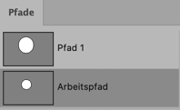
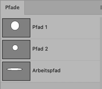

# Merge 2 Photoshop Paths

There seems to be an interesting and irritating bug in Photoshop 22.3.

Using the Pen Tool you can add subpaths to the "working path" but not to any named path. With a named path any click with the Pen Tool adds a 1-point-subpath.

Therefore this script.

If you have 2 paths in your active document, those two will be merged, no further questions.

If you have 3 or more paths, the script will ask you for a choice of 2

As far as I know a script cannot change an existing path, but it can create a new path. Thus the two selected paths will be removed and a new one will be created.

In this case you would lose the working path ("Arbeitspfad" in German), because Photoshop needs to drop the existing one to create a new one.

Caveat: I wrote this in a hurry. Test carefully.